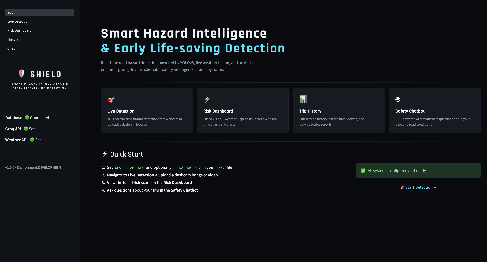
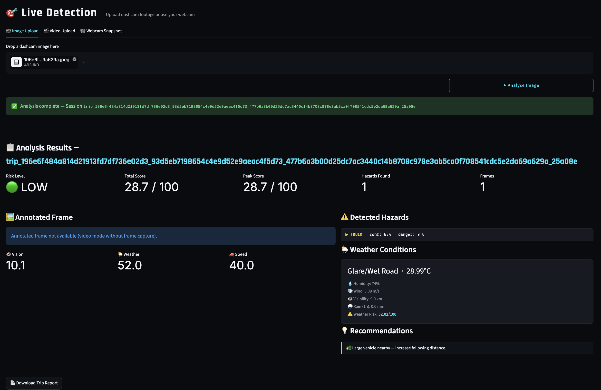
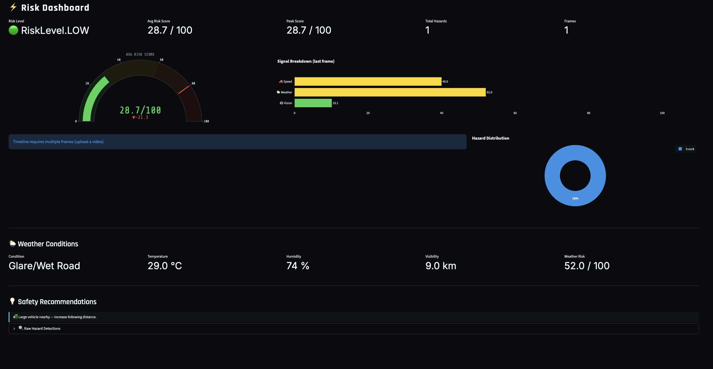
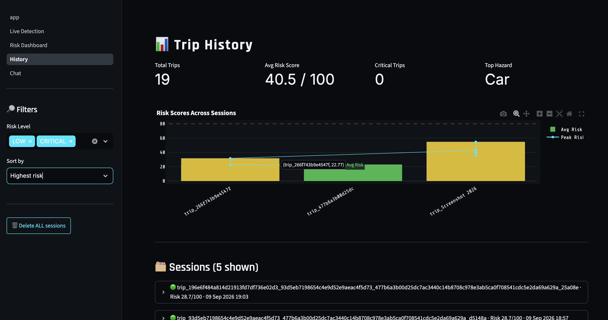
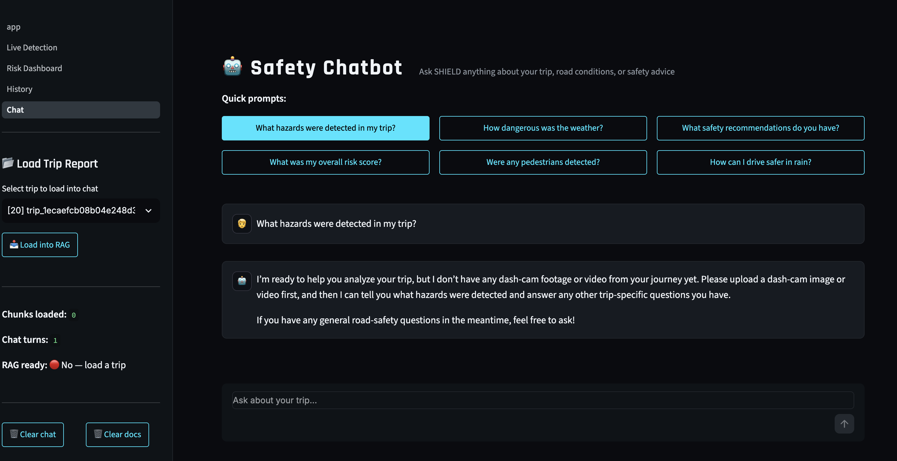

# 🛡️ SHIELD — Smart Hazard Intelligence & Early Life-Saving Detection

> **AI-powered road-safety intelligence that detects hazards, fuses environmental conditions, calculates risk, stores trip history, and provides RAG-powered safety assistance.**

SHIELD is a multi-component road-safety platform designed to transform dashcam imagery into actionable driving-risk intelligence. The system combines **YOLOv8 computer vision, weather intelligence, speed-based risk, a weighted risk engine, SQLite persistence, analytics dashboards, and Retrieval-Augmented Generation (RAG)** into one Streamlit application.

---

## 🎯 Project Overview

Traditional road-safety systems often focus on detecting individual objects such as vehicles or pedestrians. SHIELD extends this approach by combining multiple safety signals:

```text
Dashcam Image / Video
        │
        ▼
     YOLOv8
        │
        ▼
 Hazard Detection ───────────────┐
        │                        │
        ▼                        ▼
 Vision Risk              Weather Service
        │                        │
        │                        ▼
        │                  Weather Risk
        │                        │
        └──────────┬─────────────┘
                   ▼
             Risk Engine
                   │
          Vision + Weather + Speed
                   │
                   ▼
        LOW / MEDIUM / HIGH / CRITICAL
                   │
          ┌────────┴────────┐
          ▼                 ▼
     Risk Dashboard     Trip Database
                              │
                              ▼
                         Trip Report
                              │
                              ▼
                         RAG Pipeline
                              │
                              ▼
                         Vector Store
                              │
                              ▼
                       LLM Safety Chatbot
```

---

## ✨ Key Features

- 🎯 **YOLOv8 hazard detection** from images, videos, or webcam snapshots
- 🌦️ **Live weather integration** for environmental risk assessment
- ⚡ **Multi-signal risk scoring** using vision, weather, and speed
- 📊 Interactive **Risk Dashboard**
- 📜 Persistent **Trip History**
- 💬 RAG-powered **Safety Chatbot**
- 🗃️ SQLite database for trip/session persistence
- 📄 Downloadable trip reports
- 🔎 Hazard-level breakdowns and recommendations
- 🧠 ChromaDB-based semantic retrieval
- 🤖 LLM-assisted safety analysis
- 🌙 Custom dark SHIELD interface
- 🔐 Environment-variable based API configuration

---

## 🖥️ Application Screenshots

### 🏠 SHIELD Home Dashboard

The home screen provides access to the major system modules and displays the readiness of the database, Groq API, and weather integration.



---

### 🎯 Live Hazard Detection

The Live Detection module accepts dashcam images, videos, or webcam snapshots and sends visual input through the YOLOv8 detection pipeline.

The analysis shown below identifies a detected truck and combines the visual signal with weather and speed information to calculate an overall risk score.



---

### 📊 Risk Dashboard

The Risk Dashboard provides an analytical view of the latest trip, including average/peak risk, hazard counts, signal-level scores, weather conditions, and safety recommendations.



---

### 📜 Trip History

The History module provides an overview of previously processed sessions and allows trips to be filtered and sorted by risk level.



---

### 🤖 Safety Chatbot

The Safety Chatbot is designed to answer trip-specific questions using the generated trip information through the project's RAG workflow.



---

## 🧠 Core AI Architecture

### 1. Computer Vision Layer

YOLOv8 is used as the visual hazard-detection component.

The system can process:

- Static road images
- Dashcam videos
- Webcam snapshots

Detected objects are converted into structured hazard information that can be used by the downstream risk engine.

---

### 2. Weather Intelligence

Environmental conditions are incorporated into the safety assessment rather than treating visual detection as the only source of risk.

The weather component can provide information such as:

- Temperature
- Humidity
- Visibility
- Wind
- Rain
- Road/weather condition
- Weather risk score

This allows SHIELD to distinguish between visually similar situations with different environmental risk profiles.

---

### 3. Multi-Signal Risk Engine

The risk engine combines multiple safety signals into a normalized score.

The current weighting is:

| Signal | Weight |
|---|---:|
| Vision / detected hazards | 50% |
| Weather | 30% |
| Speed | 20% |

Conceptually:

```text
Overall Risk =
    0.50 × Vision Risk
  + 0.30 × Weather Risk
  + 0.20 × Speed Risk
```

The resulting score is mapped into qualitative risk levels such as:

```text
LOW
MEDIUM
HIGH
CRITICAL
```

This multi-modal fusion is a key design feature of SHIELD because road risk is rarely determined by a single factor.

---

## 🔎 RAG Safety Assistant

SHIELD includes a Retrieval-Augmented Generation pipeline for trip-specific analysis.

```text
Trip Report
    ↓
Document Chunking
    ↓
Embeddings
    ↓
ChromaDB
    ↓
Semantic Retrieval
    ↓
Relevant Context
    ↓
LLM
    ↓
Safety Response
```

The chatbot is intended to answer questions such as:

```text
What hazards were detected in my trip?
How dangerous was the weather?
What was my overall risk score?
Were any pedestrians detected?
What safety recommendations do you have?
How can I drive safer in rain?
```

The retrieval architecture helps ground the LLM response in information associated with the selected trip rather than relying only on general model knowledge.

---

## 🗄️ Data & Persistence Layer

The application uses SQLite with SQLAlchemy for persistent storage.

The database stores information associated with safety sessions, including trip-level analysis and hazard/weather/risk information.

This enables the application to provide:

- Historical trip records
- Risk trends
- Hazard distributions
- Session-level analysis
- Trip report generation
- RAG context generation

Runtime database files should remain local and should not be committed to GitHub.

---

## 📊 Analytics

The Risk Dashboard provides visual analytics including:

- Average risk score
- Peak risk score
- Total hazards
- Frame counts
- Signal-level risk breakdown
- Hazard distribution
- Weather metrics
- Safety recommendations

This converts raw detection output into an interpretable decision-support interface.

---

## 🛠️ Technology Stack

| Layer | Technology |
|---|---|
| Language | Python |
| UI | Streamlit |
| Computer Vision | YOLOv8 / Ultralytics |
| Image Processing | OpenCV |
| Data Visualization | Plotly |
| Database | SQLite |
| ORM | SQLAlchemy |
| RAG Vector Store | ChromaDB |
| Embeddings | Sentence Transformers |
| LLM Integration | OpenAI-compatible client |
| LLM Provider | Groq |
| Configuration | Python dotenv |
| Model Weights | YOLOv8n |

---

## 📁 Project Structure

```text
Shield/
│
├── pages/
│   ├── 1_Live_Detection.py
│   ├── 2_Risk_Dashboard.py
│   ├── 3_History.py
│   └── 4_Chat.py
│
├── app.py
├── config.py
├── db.py
├── models.py
├── etl_pipeline.py
├── rag_pipeline.py
├── risk_engine.py
├── weather_service.py
├── yolo_detector.py
├── requirements.txt
├── yolov8n.pt
└── README.md
```

### Main Components

**`app.py`**  
Main Streamlit entry point and SHIELD landing dashboard.

**`yolo_detector.py`**  
YOLOv8-based object/hazard detection.

**`risk_engine.py`**  
Combines vision, weather and speed signals into a normalized risk score.

**`weather_service.py`**  
Retrieves and processes weather conditions for environmental risk estimation.

**`db.py` / `models.py`**  
Database connection and SQLAlchemy data models.

**`etl_pipeline.py`**  
Transforms stored trip information into report-ready/RAG-ready data.

**`rag_pipeline.py`**  
Handles trip-report chunking, embedding, vector retrieval and LLM-assisted responses.

**`pages/`**  
Contains the Streamlit modules for detection, dashboard analytics, history and chatbot functionality.

---

## ⚙️ Installation

### 1. Clone the repository

```bash
git clone https://github.com/AribQureshi/Shield.git
cd Shield
```

### 2. Create a Python 3.11 environment

```bash
python3.11 -m venv venv
source venv/bin/activate
```

Verify:

```bash
python --version
```

### 3. Install dependencies

```bash
python -m pip install --upgrade pip
python -m pip install -r requirements.txt
```

---

## 🔑 Environment Configuration

Create a `.env` file in the project root.

Example:

```env
WEATHER_API_KEY=your_weather_api_key
GROQ_API_KEY=your_groq_api_key
```

Never commit `.env` or real API keys to GitHub.

---

## ▶️ Run the Application

Activate the environment:

```bash
source venv/bin/activate
```

Run:

```bash
python -m streamlit run app.py
```

Open the local Streamlit URL shown in the terminal, normally:

```text
http://localhost:8501
```

---

## 🧪 Typical Workflow

### Step 1 — Start SHIELD

Launch the Streamlit application.

### Step 2 — Detect hazards

Navigate to:

```text
Live Detection
```

Upload a road image/video or use a webcam snapshot.

### Step 3 — Calculate risk

The system combines:

```text
Vision Risk
+
Weather Risk
+
Speed Risk
```

and generates the overall safety score.

### Step 4 — Inspect analytics

Open:

```text
Risk Dashboard
```

to review risk metrics, hazards and environmental conditions.

### Step 5 — Review previous trips

Use:

```text
History
```

to inspect previously processed sessions.

### Step 6 — Ask safety questions

Open:

```text
Chat
```

select a trip, load its information into RAG, and ask questions about the trip.

---

## 🎓 M.Tech-Level Technical Significance

SHIELD demonstrates the integration of several advanced areas into one applied AI system:

### Computer Vision

Real-world road-scene object detection using YOLOv8.

### Multi-Modal Risk Fusion

Visual hazards are combined with environmental and speed-related signals.

### Information Retrieval

Trip information can be converted into searchable semantic representations.

### Retrieval-Augmented Generation

Retrieved trip context is supplied to an LLM for contextual safety analysis.

### Data Engineering

The ETL layer converts operational trip data into information suitable for reporting and retrieval.

### Database Engineering

Persistent trip/session records support historical analytics.

### Decision Support

Instead of returning only object labels, the platform transforms detections into a human-interpretable safety assessment.

---

## ⚠️ Limitations

The current implementation is a research/portfolio prototype and should not be treated as an autonomous driving or emergency-response system.

Important limitations include:

- YOLOv8 detection quality depends on the training/model weights and scene conditions.
- Weather data depends on external API availability and accuracy.
- The speed component requires an appropriate speed input/estimate.
- Risk weights are engineered parameters and should be validated using a larger real-world dataset.
- RAG quality depends on report generation, chunking, embeddings and retrieval quality.
- LLM responses require human verification for safety-critical decisions.
- Webcam/video performance depends on local hardware.
- The current database is designed for a local application rather than a production multi-user deployment.

---

## 🚀 Future Enhancements

### Computer Vision

- Fine-tune YOLOv8 on a dedicated road-hazard dataset
- Add traffic-light and road-sign detection
- Add lane and road-boundary detection
- Improve night/rain/fog robustness
- Add temporal tracking across video frames

### Risk Intelligence

- Learn risk weights from historical driving data
- Calibrate risk scores statistically
- Add driver behavior signals
- Add time-of-day and road-type context
- Develop uncertainty-aware risk estimation

### RAG

- Hybrid BM25 + vector retrieval
- Cross-encoder reranking
- Citation-aware answers
- Better document chunking
- RAG evaluation using Recall@K, MRR and faithfulness

### Productionization

- PostgreSQL backend
- Authentication and authorization
- REST API layer
- Docker deployment
- Cloud deployment
- Monitoring and model observability

---

## 🔐 Security Notes

Never commit:

```text
.env
*.db
*.db-shm
*.db-wal
```

or any file containing API credentials.

Use environment variables for:

```text
GROQ_API_KEY
WEATHER_API_KEY
```

If an API key has ever been accidentally exposed, revoke and regenerate it immediately.

---

## 📌 Project Status

| Component | Status |
|---|---|
| Streamlit UI | ✅ Working |
| YOLOv8 Detection | ✅ Working |
| Weather Integration | ✅ Configured |
| Risk Engine | ✅ Working |
| SQLite Persistence | ✅ Working |
| Risk Dashboard | ✅ Working |
| Trip History | ✅ Working |
| RAG Pipeline | ✅ Integrated |
| Safety Chatbot | ✅ UI Available |
| Local Development | ✅ Verified |

---

## 👨‍💻 Author

**Arib Qureshi**

M.Tech / AI & Machine Learning Project

---

## ⭐ Summary

**SHIELD** is a multi-component AI road-safety platform that moves beyond simple object detection by combining **computer vision, environmental intelligence, risk fusion, persistent analytics, and Retrieval-Augmented Generation** into a unified safety decision-support system.

> **Detect the hazard. Understand the environment. Quantify the risk. Explain the situation.**
